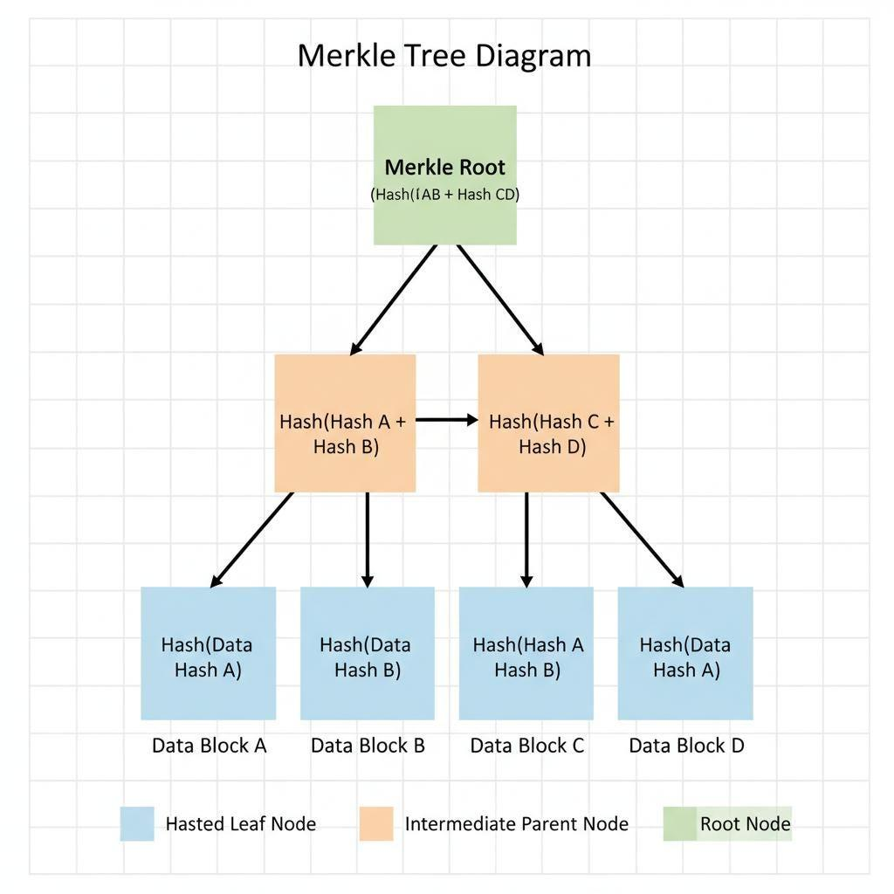
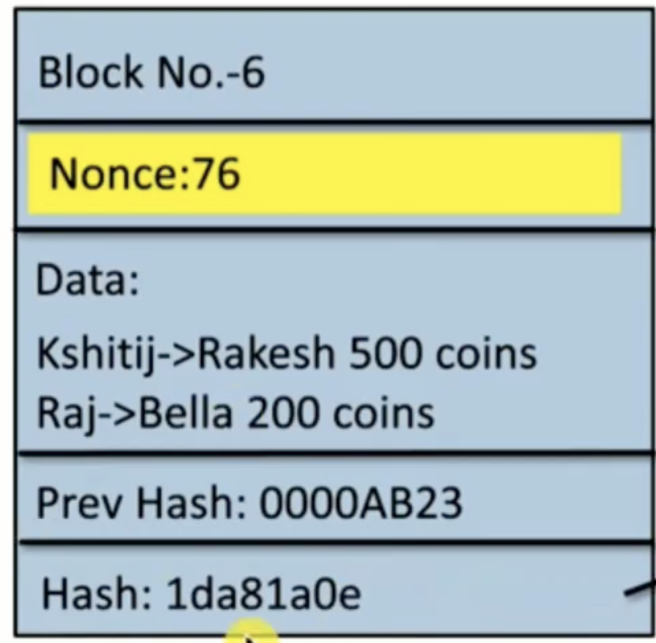

# 1. Cryptographic Primitives
- Basic building blocks used in blockchain
- Provide security, integrity, and trust
- Main primitives:
    - Hash Functions
    - Digital Signatures

## 2. What is a Hash Function?
- A hash function is a mathematical function that:
- Takes input of any size
- Produces output of fixed size (called hash or digest)
- 👉 Example:
    - Input: "Hello"
    - Output: a random-looking fixed string

### 3. Important Hash Function (SHA-256)
- Produces 256-bit output
- Widely used in blockchain (like Bitcoin)
- Very secure and collision-resistant

### 4. Properties of Cryptographic Hash Functions
1. Deterministic
Same input → Same output always

2. Collision Resistance
Two different inputs should NOT give same hash

3. Hiding Property
Cannot find original input from hash

4. Puzzle Friendliness
- Difficult to find input matching a specific condition
- Used in mining (Proof of Work)

### 5. One-Way Function
- Easy to compute:
    - x → hash(x)
- Hard to reverse:
    - hash(x) → x ❌ (very difficult)

### 6. Message Digest
- Hash output is called message digest
- Used instead of storing full data
- Why?
    - Saves space
    - Faster comparison
- 👉 To check:
    - If hash(x) == hash(y)
    - → x ≈ y

### 7. Avalanche Effect
- Small change in input → Completely different output
- 👉 Example:
    - "Hello" → A1B2C3
    - "Hello1" → Z9X8Y7 (completely different)
- Equi to **Shannon’s Theory of Confusion and Diffusion in crypto**

### 🔐 1. Basic Concepts of Cryptography
- Types:
1. Symmetric Key Cryptography
- Same key used for: Encryption and Decryption
- Problem: Key sharing is difficult

2. Public Key Cryptography
- Uses two keys: Public Key and Private Key
- Solves key sharing problem

- Key Idea:
    - Encryption → Secure data
    - Decryption → Recover data

### 🔑 2. Public Key Cryptography
- Public Key → Known to everyone
- Private Key → Secret
- Working:
    - Encrypt with public key
    - Decrypt with private key

#### Important Properties of Keys:
- Must be random
- Must be long enough
- Must have high entropy (randomness)

### 🔢 4. RSA Algorithm
- A public key cryptography algorithm
- Used for:
    - Secure communication
    - Encryption
    - Digital signatures
- Phases:
    - Key Generation
    - Key Distribution
    - Encryption
    - Decryption
- Key Concept:
    - Public Key = (e, n)
    - Private Key = (d, n)

#### RSA Formulas
- Encryption:
    - C = m^e mod n
- Decryption:
    - m = C^d mod n

#### Key Generation Steps:
1. Choose two primes → p, q

2. Compute:
- n = p × q

3. Compute:
- φ(n) = (p-1)(q-1)

4. Choose e such that:
- gcd(e, φ(n)) = 1

5. Find d:
- d × e ≡ 1 mod φ(n)
> d is private key and e is public key.
> d =(1+K*φ(n))/e .... strat K with 0,1,2,....

### ✍️ 5. Digital Signature
- A digital signature is used to:
    - Verify sender identity (`authentication`)
    - Ensure message `integrity`
    - Prevent denial (`non-repudiation`)
- Properties:
    - Only sender can sign
    - Anyone can verify
    - Signature is linked to specific message

- Process:
> Signature = Encrypt(Message, Private Key)
- Verification:
> Message = Decrypt(Signature, Public Key)
> Reverse of message encryption wrt Private and Public key.

### 🔗 6. Hashing + Digital Signature
- Why hashing is used?
    - Reduce size of data
    - Faster processing
- Process:
    - Signing:
    > S = Encrypt(Hash(M), Private Key)
    - Verification:
    > Hash(M) = Decrypt(S, Public Key)

### 🔐 7. Digital Signature in Blockchain
- Uses:
    - Validate transactions
    - Ensure authenticity
    - Prevent fraud
- Important Points:
    - Used in Bitcoin
    - Uses ECDSA (Elliptic Curve Digital Signature Algorithm)
- Provides:
    - Security
    - Non-repudiation

### Merkle Tree?
- A Merkle Tree is a tree-like data structure used in blockchain where:
    - Each leaf node = hash of data (transactions)
    - Each internal node = hash of its child nodes
    - The topmost node = Merkle Root
- 👉 It ensures data integrity and efficient verification

- Instead of storing all transactions directly, we:
    - Hash each transaction
    - Pair hashes and hash again
    - Repeat until one hash remains → Merkle Root

### 🔍 Key Features
1. Efficient Verification
Only small part of tree needed to verify data

2. Data Integrity
Any small change → completely different root

3. Tamper Proof
If one transaction changes → whole tree changes

4. Fast Searching
Reduces time complexity

### ⚡ Advantages
Saves storage
Fast verification
Secure
Scalable

### ⚠️ Disadvantages
Extra computation (hashing)
Complex structure

## Nonce :
- A nonce is a number miners change repeatedly to find a valid hash.
- It is part of the block data.
- Miners keep modifying the nonce until the hash meets the required condition (e.g., starts with certain zeros).
> Nonce = the variable you tweak again and again to get the correct hash

- 🚀 Key Properties:
    - Used only once
    - Helps ensure security
    - Can be random or incremental
    - Crucial in proof-of-work systems

### The Byzantine Generals Problem
- In blockchain distributed systems, many nodes (computers) must agree on the same data.
- But the problem is:
    - Some nodes may be faulty
    - Some may be malicious (attackers)
    - Messages may be conflicting
👉 This situation is known as the Byzantine Generals Problem

#### What is the Byzantine Generals Problem?
- It is a classic problem where:
- Multiple parties must agree on a decision
- Even if some participants:
    - Lie
    - Fail
    - Send wrong information
👉 Goal: Reach consensus despite distrust

#### How Blockchain Solves It
- Algorithms like:
    - Proof of Work (PoW)
    - Proof of Stake (PoS)
- ensure that:
    - Honest nodes dominate
    - Agreement is reached on one valid chain

