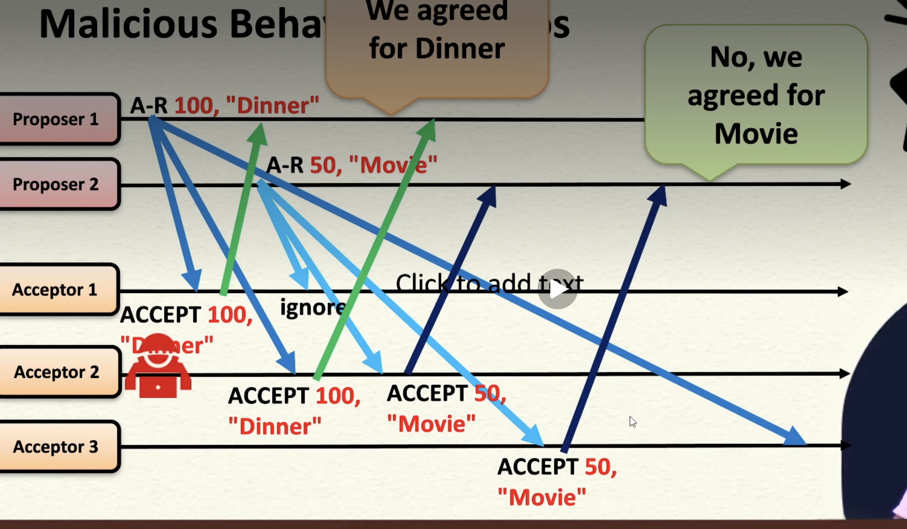
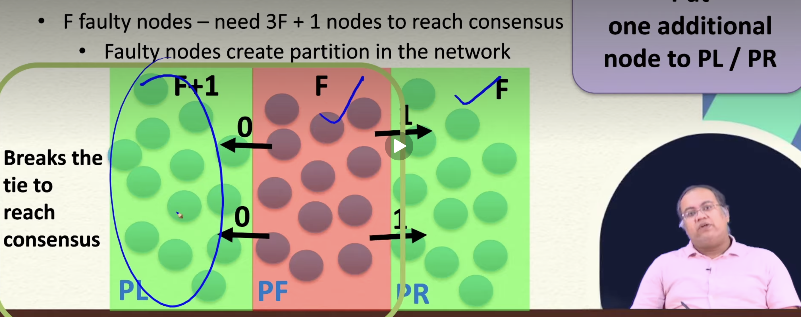

# Byzantine Fault Tolerance & Byzantine Agreement

## ⚠️ 1. What is Byzantine Fault?
- Fault where node behaves maliciously or arbitrarily
- Examples:
    - Sending wrong messages
    - Sending different messages to different nodes
    - Violating protocol
- Key Idea:
    - Crash fault → Node stops
    - Byzantine fault → Node lies

## ❌ 2. Limitation of Paxos
- Paxos handles:
- ✔️ Crash faults
- Paxos fails for:
❌ Byzantine faults
- Why?
Assumes nodes follow protocol
Cannot handle malicious behavior

## Malicious(Byzantine) Behaviiour in Paxos:

## 🔍 4. Fault Detection vs Fault Tolerance
1. 🔹 Byzantine Fault Detection (BFD)
Detect something is wrong
✔️ Possible with small system

2. 🔹 Byzantine Fault Tolerance (BFT)
Reach consensus despite faults
❌ Harder problem
Key Difference:
Detection ≠ Consensus

## ⚠️ 5. Case: 1 Commander + 2 Lieutenants
- Observation:
Messages differ → fault detected
- Problem:
❌ Cannot decide:
- Who is faulty?
- What action to take?
- Conclusion:
    > Cannot achieve consensus

## ✅ 6. Case: 1 Commander + 3 Lieutenants
- Process:
Nodes share received messages
Count majority
- Example:
| Messages            | Result  |
| ------------------- | ------- |
| 2 Attack, 1 Retreat | Attack  |
| 2 Retreat, 1 Attack | Retreat |
- Conclusion:
    > Majority → Consensus achieved

## 🔁 7. Majority Voting in BFT
- Choose value with maximum votes
- Requirement:
Enough honest nodes
- Key Insight:
Honest nodes outvote faulty ones

## ❌ 8. Impossibility in Small Systems
1. Case:
3 nodes (1 faulty)
Result:
❌ No guaranteed consensus
- Reason:
Equal split possible
No clear majority

## 🔢 9. 3F + 1 Rule (VERY IMPORTANT)
Formula:
> Total Nodes ≥ 3F + 1
Where:
F = number of Byzantine faulty nodes
- Example:
| Faults (F) | Required Nodes |
| ---------- | -------------- |
| 1          | 4              |
| 2          | 7              |
- Meaning:
System needs strong majority to tolerate faults

## 🧠 10. Why 3F + 1 Needed?
- Faulty nodes can create confusion
- Byzantine Behavior:
- Send different values to different groups
- Result:
Network splits into partitions

## 🔗 11. Network Partition Concept
- Structure:
Correct nodes | Faulty nodes | Correct nodes
- Problem:
Faulty nodes isolate groups
Prevent communication
- Result:
❌ No consensus

## ⚖️ 12. Breaking the Partition
- Solution:
Add extra node in any partation ensures consensus
- Insight:
Extra node → Break tie → Achieve majority
- Final Requirement:
3F + 1 ensures majority even after partition

## 📌 13. Conceptual Proof Summary
- Worst Case:
Faulty nodes split network equally
- Without extra node:
❌ No majority
- With extra node:
✔️ One side gets majority

## 🔁 14. Agreement vs Consensus
- Agreement:
Temporary decision
Step in process
- Consensus:
Final decision
Example:
- Paxos:
Round 1 → Agreement on ID
Round 2 → Agreement on value

# 📊 Final Summary
| Concept          | Key Idea       |
| ---------------- | -------------- |
| Byzantine Fault  | Malicious node |
| Paxos Limitation | No BFT         |
| Detection        | Easy           |
| Tolerance        | Hard           |
| Majority         | Needed         |
| 3F + 1           | Minimum nodes  |
