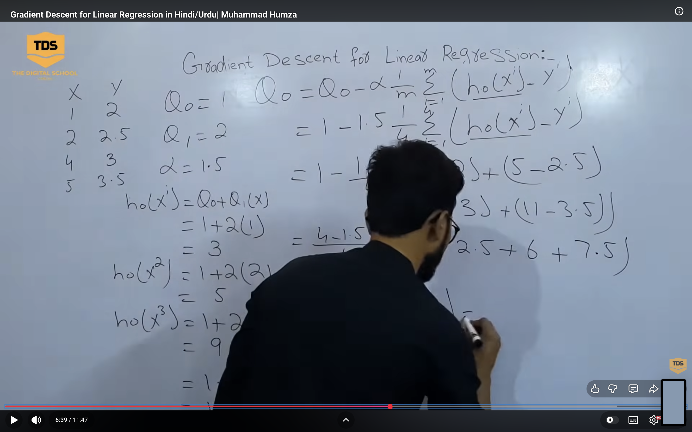
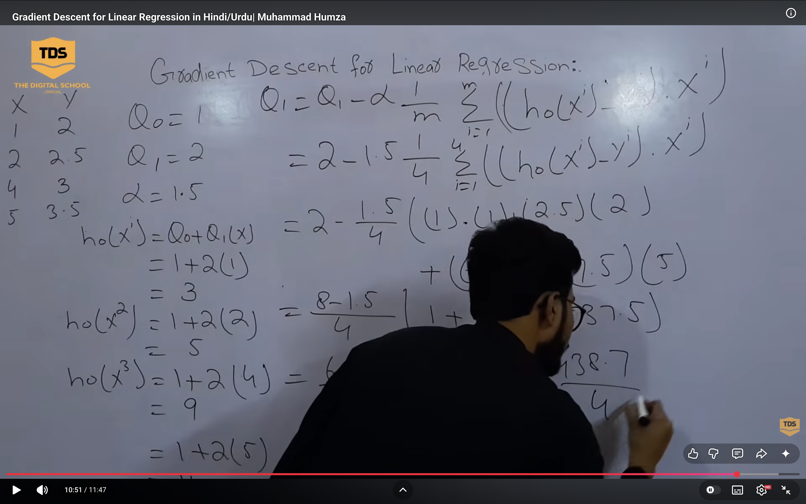

# Find the approximate linear regression line using Gradient Descent technique for the
following linear regression model. Assume the initial value of mo=l0, bo=0 and learning
rate -0.1. (NOTE :Apply only two iteration)
---
- Gradient Formulas
>  ∂J/∂m ​=1/n * ​∑((mx+b−y)x)
>  ∂J/∂b ​=n1​∑(mx+b−y)

1. 🔁 Iteration 1
∂J/∂m = 78
∂J/∂b = 24
- m1 =10−0.1(78)=2.2
- b1 =0−0.1(24)=−2.4

2. 🔁 Iteration 2
m2 and b2 

- answer : 
> y = m2x+b2
---

#  

1. (a) Curse of Dimensionality
- Refers to problems that arise when the number of features (dimensions) increases.
- As dimensions ↑:
    Data becomes sparse
    Distance metrics lose meaning
    Model needs more data to generalize
    Leads to overfitting and high computational cost.
- Solution: Feature selection, PCA (dimensionality reduction).

2. R² vs Adjusted R²
- R² (Coefficient of Determination)
Measures how well model explains variance in data.
> R²=1 −​ SSres​​ / SStot 
- Range: 0 to 1
Problem: Always increases when new features are added.

- Adjusted R²
Adjusts R² by penalizing unnecessary features.
> Adjusted R²=1−((1−R²)(n−1)​)/ (n−k−1 )
- n: samples, k: features
Useful for model comparison

3. (c) Bias-Variance Trade-Off
Bias: Error due to overly simple model (underfitting)
Variance: Error due to overly complex model (overfitting)
> Total Error=Bias^2+Variance+Irreducible Error
- Goal: Find balance
High Bias → Underfit
High Variance → Overfit

4. (d) Micro vs Weighted Precision
- Micro Precision
Computes globally across all classes
> Precision(micro​)= ∑TP​ / ∑(TP+FP) 
Treats all instances equally

- Weighted Precision
Average precision weighted by class size
> Precision(weighted​)=∑((support(i)​ ​× precision(i)​)/total)
Handles class imbalance better

5. (e) Stochastic Gradient Descent (SGD)
- Optimization technique used to minimize loss function.
- Updates parameters using one data point at a time:
> θ=θ−α∇J(θ)
- Key Points:
Faster than batch gradient descent
Noisy updates (zig-zag path)
Works well for large datasets

