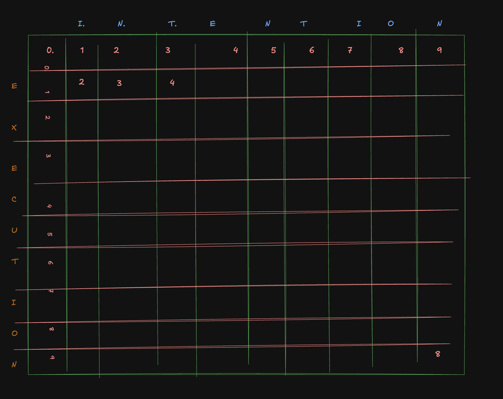

# 
1. ✅ Vocabulary (V)
- Words:
> {i, want, to, eat, Chinese, food, lunch, spend}
- 👉 V=8

2. 🔹 (a) Calculate P(to∣want) and P(to∣i want)
- From table:
C(want, to)=608
C(want)=927
- P(to∣want)= 608+1​  /  927+8 ​≈0.651

3. 
P(I want to eat Chinese food)
- Using bigram model:
> P=P(i)⋅P(want∣i)⋅P(to∣want)⋅P(eat∣to)⋅P(Chinese∣eat)⋅P(food∣Chinese)

P≈2541828​×935609​×2425687​×75417​×16683​ === 👉 ≈ 0.00067 (very small, expected)

4. P(I want to eat English food)
- 👉 Problem:
“English” is NOT in vocabulary
> P(English∣eat)= 1 / 754

P=P(i)⋅P(want∣i)⋅P(to∣want)⋅P(eat∣to)⋅P(English∣eat)⋅P(food∣English)	​

- But:
> P(food∣English)= 1/V = 1/8	​

- P≈2541828​×935609​×2425687​×7541​×81​ <<< P(I want to eat Chinese food)

# “The quick brown fox jumps over the lazy dog.
The lazy dog sleeps all day.
The quick brown fox never jumps over the sleeping cat.”

1. 🔹 (ii) Probability of Sentence
“The quick brown fox jumps over the sleeping cat”
> P=P(The)⋅P(quick∣The)⋅P(brown∣The,quick)⋅P(fox∣quick,brown)⋅P(jumps∣brown,fox)⋅P(over∣fox,jumps)⋅P(the∣jumps,over)⋅P(sleeping∣over,the)⋅P(cat∣the,sleeping)
> P=2/3​×1/3​=1/33​≈0.333
- start from word 0 , which isnt a case if directly probability is needed to be calculated.

3. (iii) Perplexity
- Using:
    > PP=P^-1/N
- Where:
P = 1/3
N=9 words
- PP≈1.13

# 

1. 🔹 (a) Morphology
- Morphology is the study of the structure of words and how they are formed using morphemes (smallest meaningful units).
- Examples:
---
unhappiness → un + happy + ness
cats → cat + s
redo → re + do
---
👉 Shows how words are built and modified.

2. 🔹 (b) Orthography
- Orthography is the study of the correct spelling and writing system of a language.
- Examples:
    Correct: receive ✅ vs Wrong: recieve ❌
    The quick brown fox jumps over the lazy dog (correct sentence)
    Capitalization: india ❌ → India ✅
- 👉 Focuses on spelling rules and writing conventions.

3. 🔹 (c) Phonology
- Phonology is the study of sounds in a language and how they are organized and used.
- Examples:
cat /kæt/ vs bat /bæt/ (change in sound changes meaning)
Silent letters: knife → /naɪf/
Stress patterns: record (noun) vs record (verb)
- 👉 Deals with pronunciation and sound patterns.

| Topic       | Focus              | Example            |
| ----------- | ------------------ | ------------------ |
| Morphology  | Word formation     | un + happy + ness  |
| Orthography | Spelling & writing | receive vs recieve |
| Phonology   | Sounds             | cat vs bat         |

# Wagner–Fischer (Levenshtein Distance)
1. Delete t and add c.
i n e c n t i o n
e x e c u t i o n

2. substitute rest 3 

==> 8 answer.

## STeps :
1. 🔹 Step 1: Initialize DP Table
Source = intention (length = 9)
Target = execution (length = 9)
- Create matrix (10 × 10)
Base cases:
First row = 0 → 9 (insertions)
First column = 0 → 9 (deletions)

2. 🔹 Step 2: Recurrence Relation

D(i,j)=min ⎧ D(i−1,j)+1 (insertion)
           ⎨ D(i,j−1)+1 ​(deletion)
           ​⎩ D(i−1,j−1)+cost. (substitution)​
- Where:
cost = 0 if same character
cost = 2 if different

3. 🔹 Step 3: Key Observations
| intention | execution  |
| --------- | ---------- |
| i → e     | substitute |
| n → x     | substitute |
| t → e     | substitute |
| e → c     | substitute |
| n → u     | substitute |
| t → t     | match      |
| i → i     | match      |
| o → o     | match      |
| n → n     | match      |

4. Make Table:

# 1. What is Tokenization?
- Tokenization = breaking text into smaller units (tokens)
- Examples:
Word-level → “I love NLP” → [I, love, NLP]
Subword-level → “lower” → [low, er]

## 🔹 2. Advantage of Byte Pair Encoding (BPE)
✔ Handles unknown words (OOV problem)
✔ Reduces vocabulary size
✔ Learns subwords (like prefixes/suffixes)
✔ Improves NLP models (used in GPT, BERT)

## 🔹 3. Given Training Data
| Word   | Frequency |
| ------ | --------- |
| low    | 5         |
| lowest | 2         |
| newer  | 6         |
| wider  | 3         |
| new    | 2         |

### 🔹 Step 1: Initialize (character-level)
- Add end symbol </w>:
l o w </w> (5)
l o w e s t </w> (2)
n e w e r </w> (6)
w i d e r </w> (3)
n e w </w> (2)

### 🔹 Step 2: Count symbol pairs
- Compute most frequent adjacent pairs:
- Important pairs (weighted by frequency):
(l,o) → 5 + 2 = 7
(o,w) → 5 + 2 = 7
(w,e) → 2 + 6 = 8
(e,r) → 6 + 3 = 9 ✅ highest
(n,e) → 6 + 2 = 8

### 🔹 Step 3: Merge most frequent → (e,r) → er
- Updated corpus:
l o w </w>
l o w e s t </w>
n e w er </w>
w i d er </w>
n e w </w>

### 🔹 Step 4: Recompute pairs
- Now frequent pairs:
(w,er) → 6
(n,e) → 8
(e,w) → 8
- 👉 Merge (n,e) → ne

### 🔹 Step 5: Update
l o w </w>
l o w e s t </w>
ne w er </w>
w i d er </w>
ne w </w>

### next upadte
- Frequent:
- (ne,w) → 8 → merge → new

l o w </w>
l o w e s t </w>
new er </w>
w i d er </w>
new </w>

### 🔹 Step 10: Next merge
(lo,w) → 7 → merge → low

### 🔹 Final Vocabulary (important merges)
er
ne
new
lo
low

## 🔹 4. Testing on word: “lower”
- Start with:
l o w e r

- Apply merges in order:
- Step 1: (l,o) → lo
lo w e r
- Step 2: (lo,w) → low
- low e r
- Step 3: (e,r) → er
low er

### ✅ Final Tokenization
👉 lower → [low, er]

## summary :  
### Training (Key merges):
(e,r) → er
(n,e) → ne
(ne,w) → new
(l,o) → lo
(lo,w) → low
### Testing:
lower→[low,er]

# 🔹 (1) Segmentation
- Segmentation is the process of dividing text into meaningful units such as sentences, words, or subwords.
- 👉 It is especially important for languages where words are not separated by spaces (e.g., Chinese).
- 📌 Types:
    Sentence segmentation
    Word segmentation
- 📌 Examples:
1. Sentence segmentation:
"I love NLP. It is amazing."
→ [I love NLP] , [It is amazing]
2. Word segmentation:
"iloveindia"
→ [i, love, india]

## 🔹 (2) Lemmatization
- Lemmatization converts a word into its base or dictionary form (lemma) using vocabulary and grammar rules.
- 👉 It gives meaningful words
- 
| Word    | Lemma |
| ------- | ----- |
| running | run   |
| better  | good  |
| went    | go    |
- 📌 Key Point:
✔ Context-aware
✔ Produces real words

## 🔹 (3) Stemming
- Stemming reduces a word to its root form by removing suffixes, often using simple rules.
- 👉 Output may not be a valid word
- 
| Word    | Stem  |
| ------- | ----- |
| playing | play  |
| studies | studi |
| happily | happi |
- 📌 Key Point:
✔ Fast and simple
❌ Not always meaningful

| Feature  | Lemmatization   | Stemming         |
| -------- | --------------- | ---------------- |
| Output   | Valid word      | May not be valid |
| Method   | Uses dictionary | Uses rules       |
| Accuracy | High            | Lower            |
| Example  | better → good   | better → better  |

