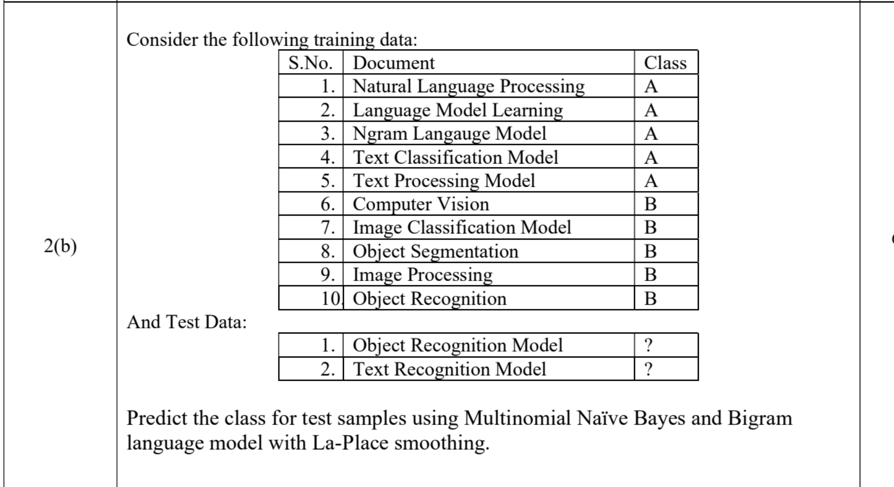

# 
|                 | Predicted Negative | Predicted Positive |
| --------------- | ------------------ | ------------------ |
| Actual Negative | 900                | 50                 |
| Actual Positive | 20                 | 130                |

🔹 Identify values
- TP (True Positive) = 130
- FP (False Positive) = 50
- FN (False Negative) = 20
- TN (True Negative) = 900
> 2nd and first

1.  Precision
- 👉 How many predicted positives are actually correct
> Precision= TP /(TP​ + FP)
2. Recall
- 👉 How many actual positives are correctly identified
> Recall  = TP / (TP+FN)

3. 📌 F1-Score (F-measure)
- 👉 Balance between precision & recall
- F-measure is the harmonic mean of Precision and Recall, giving a balanced measure.
> F1= 2⋅Precision⋅Recall​ / Precision+Recall 

# Compute the most likely class for Doc 5. Assume a multinomial naive Bayes classifier
- 

- add-1 smooting 

1. Priors :
- Probablity of Outputs wrt each other 

2. Conditional Probablitoes:
> P(Chinese |  c) = (count of Chinese in which c is o/p +1 ) / (Total inputs in which c is o|p)+V.

3. Choosing class
- 
P(c | d5) 
and
P(j | d5)

# For add 2 smooting 
> P(B) = (Count(B) + 2 )/ (Total + 2V)

# 

-  Instead of calcutaing prob of P(B/A) , calculate bigram probs ,  P(bigram∣Class)= Count+1 / Total_bigrams+V  

1. Step 1: Classes
Class A → 5 docs (NLP related)
Class B → 5 docs (Vision related)
- P(A)= 5/10 =0.5,
P(B)=0.5

2. 🔹 Step 2: Build Bigrams

3. 🔹 Step 3: Vocabulary of Bigrams
- Total unique bigrams ≈ 10
👉 V=10

4. 🔹 Step 4: Apply Laplace Smoothing
> P(bigram∣Class)= Count+1 / Total_bigrams+V

5. 🔹 Step 5: Test 1
- Divide test data into bigrams.
    - 👉 “Object Recognition Model”
        Bigrams:
        Object Recognition
        Recognition Model
- 🔸 Class A
Object Recognition → 0
Recognition Model → 0
> P∝0.5⋅ 1/15​⋅1/15​

