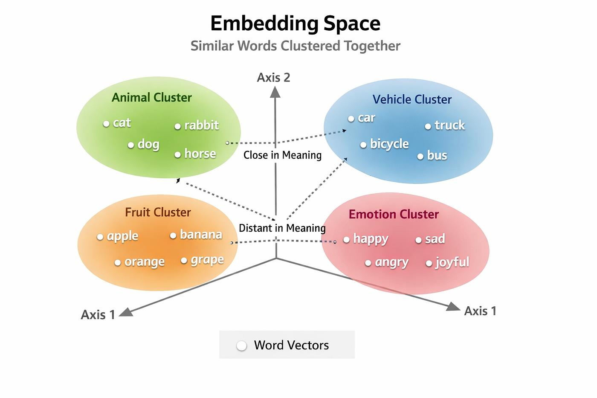

# 

## 🧠 What are Word Vectors?
- Word vectors (also called embeddings) are numerical representations of words in a vector (array) form so that machines can understand language.
- 👉 Each word is represented as a list of numbers:
"cat" → [0.2, -0.5, 0.8, ...]
"dog" → [0.25, -0.45, 0.75, ...]
- 👉 Words with similar meanings have similar vectors.

- Illustaration

- 👉 In this space:
    cat and dog are close
    king and queen are related
- distance = similarity

### 🔹 Types of Word Vectors
1. Sparse Vectors
- Mostly zeros
- High dimensional (very large size)
- 👉 Example (Bag of Words):
Vocabulary = [cat, dog, apple, car]
"cat" → [1, 0, 0, 0]
"dog" → [0, 1, 0, 0]

2. Dense Vectors
- Mostly non-zero values
- Low dimensional (compact)
- Learned using models like Word2Vec, GloVe
- 👉 Example:
"cat" → [0.21, -0.34, 0.78]
"dog" → [0.25, -0.30, 0.80]

| Feature    | Sparse Vector       | Dense Vector     |
| ---------- | ------------------- | ---------------- |
| Values     | Mostly 0s           | Mostly non-zero  |
| Size       | Very large          | Small            |
| Meaning    | No semantic meaning | Captures meaning |
| Example    | Bag of Words        | Word2Vec, GloVe  |
| Efficiency | Low                 | High             |

- 💡 Key Insight (Exam Line)
👉 Sparse vectors represent presence of words,
👉 Dense vectors represent meaning of words.

# Word-context matrix and Pointwise Mutual Information (PMI) and Cosine Similarity
🔹 Given Corpus
The cat sat on the mat
The dog played in the yard
The cat and the dog are friends
---
1. 🔹 Step 1: Context Window = 2
For each word → take 2 words left + 2 words right

2. 🔹 Step 2: Focus words → cat and dog
- 🔸 Context of cat
- From sentences:
“The cat sat on the mat” → {The, sat, on}
“The cat and the dog are friends” → {The, and, the}
- 👉 Combined context words:
{the,sat,on,and}

- 🔸 Context of dog
“The dog played in the yard” → {The, played, in}
“The cat and the dog are friends” → {the, and, are}
- 👉 Combined:
{the,played,in,and,are}

3. 🔹 Step 3: Vocabulary (Context words)
V={the,sat,on,and,played,in,are}

4. 🔹 Step 4: Word-Context Matrix (Counts)
or ✅ Co-occurrence Matrix
| Word \ Context | the | sat | on | and | played | in | are |
| -------------- | --- | --- | -- | --- | ------ | -- | --- |
| cat            | 2   | 1   | 1  | 1   | 0      | 0  | 0   |
| dog            | 2   | 0   | 0  | 1   | 1      | 1  | 1   |

5. 🔹 Step 5: PMI Formula (Pointwise Mutual Information)
```yml
  PMI(w,c)= log2 P(w,c)
                 ------
                (P(w)P(c))
```

6. 🔹 Step 6: PMI Vectors (Simplified Insight)
Words co-occurring more than expected → positive PMI
Rare co-occurrence → low/negative
- 🔸 PMI Vector for cat
[the,sat,on,and]⇒[high,medium,medium,medium] 
- 🔸 PMI Vector for dog
[the,and,played,in,are]⇒[high,medium,medium,medium,medium]

7. 🔹 Step 7: Common Dimensions
- Common context words:
{the,and}

8. 🔹 Step 8: Cosine Similarity
> cos(θ)= cat⋅dog / ∣cat∣∣dog∣
​​- since {the,and} are common => higer cos => angle less => High similarity.

# Skip-gram and negative sampling and cross-entropy loss

## 🔹 Given Corpus
The cat sat on the mat
The dog played in the yard
The cat and the dog are friends

1. 🔹 (i) Skip-gram Dataset (window size = 1)
- 👉 For each target word, take 1 word left + 1 word right
- 🔸 Sentence 1:
The cat sat on the mat
| Target | Context  |
| ------ | -------- |
| The    | cat      |
| cat    | The, sat |
| sat    | cat, on  |
| on     | sat, the |
| the    | on, mat  |
| mat    | the      |
- 🔸 Sentence 2:
The dog played in the yard
| Target | Context     |
| ------ | ----------- |
| The    | dog         |
| dog    | The, played |
| played | dog, in     |
| in     | played, the |
| the    | in, yard    |
| yard   | the         |
...

2. 🔹 Positive Training Pairs
- Examples:
    (cat, sat), (sat, cat)
    (dog, played), (played, dog)
    (cat, and), (dog, are)
etc.
- 👉 These are (target, context) pairs

- 🔹 Negative Sampling
👉 For each positive pair, generate k negative pairs
- Example:
    Positive: (cat, sat)
    Negative: (cat, yard), (cat, friends), (cat, played)
👉 Negative words sampled randomly from vocabulary

3. 🔹 Final Training Dataset
> Dataset={(wt​,wc​,y)}
- Where:
y=1 → positive
y=0 → negative

## 🔹 (ii) Cross-Entropy Loss (Skip-gram with Negative Sampling)
- 🔸 Objective
Maximize:
> logσ(vc​⋅vt​)+k=1∑K​logσ(−vnk​​⋅vt​)

- 🔸 Total Loss (to minimize)
> L = −(wt​,wc​)∑​[logσ(vc​⋅vt​)+k=1∑K​logσ(−vnk​​⋅vt​)]
- Where
    - vt -> target word vector
    - vc -> context word vector
    - vn → negative sample vector
    - σ(x)= 1 / 1+e^−x


# Calculate the similarity between good and fool using (i) cosine similarity (ii) PPMI. Use add 2 smoothing if necessary.
---

1. Given vectors , put in here:
> cos(θ)= A⋅B​ / ∣∣A∣∣∣∣B∣∣
cos(θ)= 73 / root(219)​⋅root(638)​​≈73 / 374 ​≈ 0.195
- ✅ Cosine Similarity ≈ 0.20
👉 Low similarity

2. PPMI
> PPMI(x,y)=max(PMI(x,y),0)
- use sum of values if no other way.
