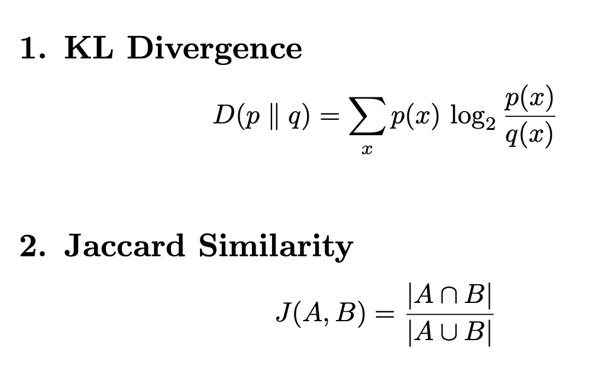

# HMM (Hidden Markov Model) for POS(Parts of speech) Tagging

## 13. Compute probability of tag sequence “NN VB” for “dogs bark” using given emission and transition probabilities.
> P(tags,words)=P(START→NN)⋅P(dogs∣NN)⋅P(NN→VB)⋅P(bark∣VB)

## 23. From the same corpus, compute perplexity of the bigram model on the test sentence “a bird sings”.
> PP(W)=(1/P(w1​,w2​,...,wn​)​)^1/n
- Using bigram:
> P=P(a)⋅P(bird∣a)⋅P(sings∣bird)
- ⚠️ From given corpus:
P(sings∣bird)= 1/2
P(bird∣a)=1/2
- P≈P(a)⋅0.5⋅0.5

## 30. Data Sparsity in N-grams
- 📌 Problem:
Many word combinations never appear
- ❌ Example:
“dog eats pizza” not in corpus
→ probability = 0
- 📌 Issues:
Zero probability
Poor generalization
Large vocabulary problem
- ✅ Solutions:
> Laplace smoothing
Good-Turing
Kneser-Ney

# Topic Modeling
> θk​= nk​+α​ / N+K*α
- small above , Capital below + α

# 🔹 47. Euclidean vs Cosine Similarity
| Feature                | Cosine  | Euclidean |
| ---------------------- | ------- | --------- |
| Measures               | Angle   | Distance  |
| Range                  | -1 to 1 | 0 to ∞    |
| Sensitive to magnitude | ❌ No    | ✔ Yes     |
| Best for text          | ✔ Yes   | ❌ No      |

# Zipf’s Law
- In natural language, the frequency of a word is inversely proportional to its rank in the frequency table.
> f(r)=C​/r
> f(1)=C
- Where:
f(r) = frequency of word with rank r
r = rank (1 = most frequent word)
C = constant
- 🧠 Intuition
Few words occur very frequently (e.g., “the”, “is”)
Many words occur rarely
👉 Language has a long-tail distribution

# 📌 Heaps’ Law:
- Vocabulary size grows sublinearly with corpus size.
> V= kN^β
- Where:
    V(n) = vocabulary size
    K = constant
    N = total number of words or `corpus size`
    β∈(0.4,0.6)
- 🧠 Intuition
- As you read more text:
    New words keep appearing
    But rate slows down

# 🔹 68. CBOW vs Skip-gram
1. 📌 CBOW (Continuous Bag of Words)
Input → context words
Output → target word
2. 📌 Skip-gram
Input → center word
Output → context words
- 
| Feature    | CBOW              | Skip-gram         |
| ---------- | ----------------- | ----------------- |
| Predicts   | word from context | context from word |
| Speed      | faster            | slower            |
| Rare words | poor              | good              |
| Accuracy   | lower             | higher            |

# MaxEnt vs NB
| Concept     | Key Idea             |
| ----------- | -------------------- |
| MaxEnt      | max uncertainty      |
| NB          | independence         |
| Constraints | feature expectations |
| Advantage   | flexibility          |

# KL Divergence & Jaccard Similarity

1. KL Divergence (Kullback–Leibler Divergence)
Measures how one probability distribution differs from another.

2. Jaccard Similarity
Measures similarity between two sets.

