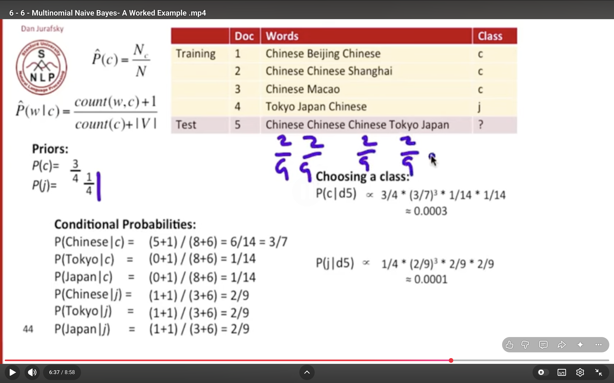

# 
|                 | Predicted Negative | Predicted Positive |
| --------------- | ------------------ | ------------------ |
| Actual Negative | 900                | 50                 |
| Actual Positive | 20                 | 130                |

🔹 Identify values
- TP (True Positive) = 130
- FP (False Positive) = 50
- FN (False Negative) = 20
- TN (True Negative) = 900
> 2nd and first

1.  Precision
- 👉 How many predicted positives are actually correct
> Precision= TP /(TP​ + FP)

2. Recall
- 👉 How many actual positives are correctly identified
> Recall  = TP / (TP+FN)

3. 📌 F1-Score (F-measure)
- 👉 Balance between precision & recall
- F-measure is the harmonic mean of Precision and Recall, giving a balanced measure.
> F1= 2⋅Precision⋅Recall​ / Precision+Recall 

# Compute the most likely class for Doc 5. Assume a multinomial naive Bayes classifier
- 

- add-1 smooting 

1. Priors :
- Probablity of Outputs wrt each other 

2. Cionditional Probablitoes:
> P(Chinese |  c) = (count of Chinese in which c is o/p +1 ) / (Total inputs in which c is o|p)+V.

3. Choosing class
- 
P(c | d5) 
and 
P(j | d5)

# For add 2 smooting 
> P(B) = (Count(B) + 2 )/ (Total + 2V)
