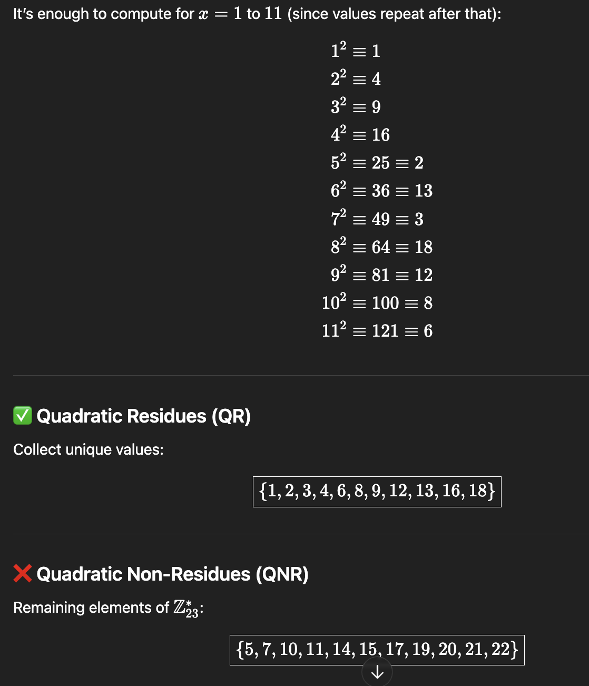
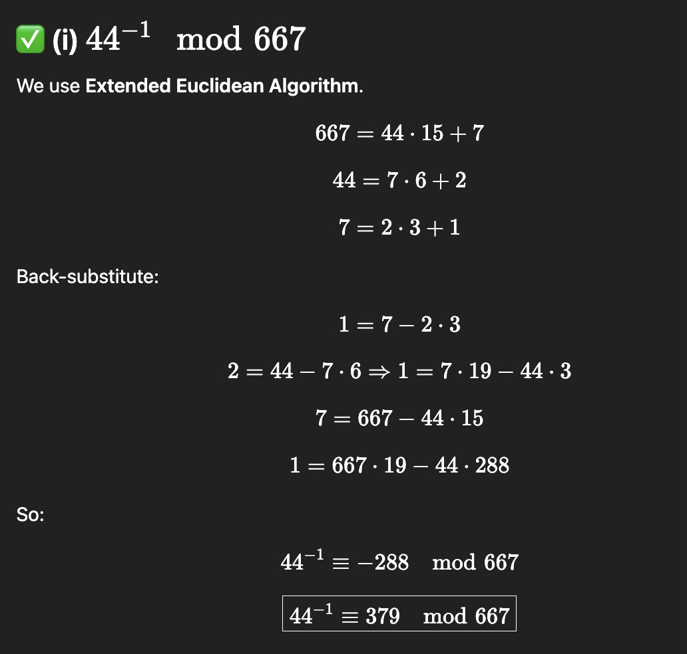
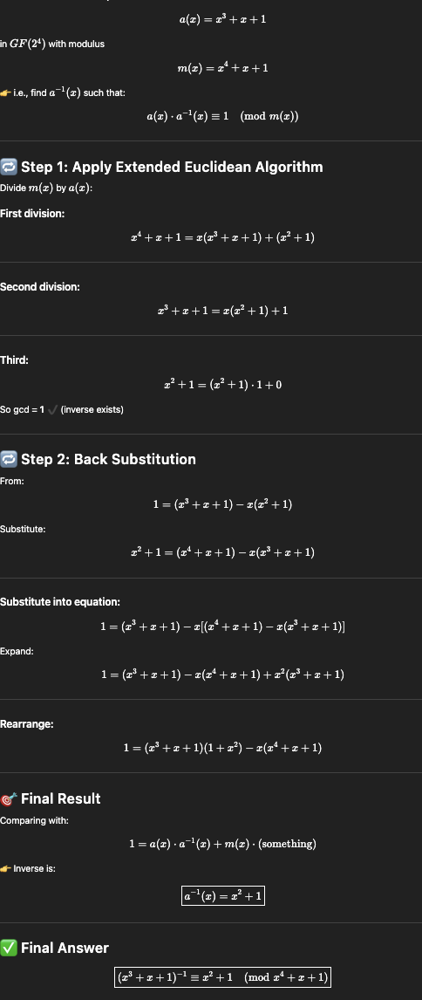
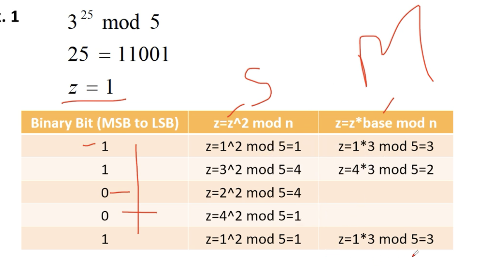

# 
1. 🧠 Step 1: Idea of Chosen Plaintext Attack
- In such questions, we assume:
We can guess some common plaintext patterns
Then use two letter mappings to find a and b
- FF → repeated letters
- UU, CC → repeated patterns
- 👉 In English, common repeated plaintext letters:
EE, LL, SS, OO
> LOSE

2. Try b = 15.

3. 
a=4,b=15

# CHINESEE THEOREM
- 🔢 Given
X≡2(mod5)
X≡3(mod7)
X≡10(mod11)

1. 🧠 Step 1: Compute Product
- M=5×7×11=385.

2. 🧮 Step 2: Compute M<i>
- M1​= 385/5​=77,
- M2​=385 / 7 ​=55,
- M3​=385/11​=35

3. 🔁 Step 3: Find Inverses
- We need:
    1. 77^−1mod5
    - 77≡2mod5, inverse of 2 mod 5 = 3
    - 👉 y1=3
    2. 55^−1mod7
    - 55≡6mod7, inverse of 6 mod 7 = 6
    👉 y2=6
    3. 35^−1mod11
    35≡2mod11, inverse of 2 mod 11 = 6
    👉 y3=6

4. 🧾 Step 4: Apply CRT Formula
> X= a1.M1.​y1 ​+a2​M2​y2​+ a3​M3​y3​ mod385
X=(2⋅77⋅3)+(3⋅55⋅6)+(10⋅35⋅6)
X=462+990+2100=3552

5. X≡3552 mod 385
=> X = 87 ans.

# Quadratic residues are numbers of the form x^2 mod23.

# Find the result of multiplying Pl = (*+ x?+ x) by P2 = (x'+ x + x' +x'
+x) in GF(2) with irreducible polynomial (x +** + x +x+ 1).

1. 🧮 Step 1: Multiply. P1​⋅P2​

2. Reduce mod m(x) , by dividing using irreducible

3. Remainder is ans

- Exam Tip
- Always:
Multiply normally
XOR like terms
Reduce powers ≥ 8 using irreducible polynomial

# Find the value of g20g^{20}g20 for the defined Galois field GF(24)GF(2^4)GF(24) using the irreducible polynomial f(x)=x4+x+1f(x) = x^4 + x + 1f(x)=x4+x+1.”

| Power    | Value (Polynomial Form) |
| -------- | ----------------------- |
| (g^0)    | 1                       |
| (g^1)    | (x)                     |
| (g^2)    | (x^2)                   |
| (g^3)    | (x^3)                   |
| (g^4)    | (x + 1)                 |
| (g^5)    | (x^2 + x)               |
| (g^6)    | (x^3 + x^2)             |
| (g^7)    | (x^3 + x + 1)           |
| (g^8)    | (x^2 + 1)               |
| (g^9)    | (x^3 + x)               |
| (g^{10}) | (x^2 + x + 1)           |
| (g^{11}) | (x^3 + x^2 + x)         |
| (g^{12}) | (x^3 + x^2 + x + 1)     |
| (g^{13}) | (x^3 + x^2 + 1)         |
| (g^{14}) | (x^3 + 1)               |
| (g^{15}) | 1                       |

- use of irreducible poly x4+x+1.
=> x^4 = x+1
> x5=x⋅x4=x(x+1)=x2+x
and so on

# 44^−1 mod667
- We use Extended Euclidean Algorithm.

- Target 
    - make 1 = 667*x + 44*y
    - 1 = 667⋅19 − 44⋅288

- similar on this :

# Square and Multiply Algorithm

