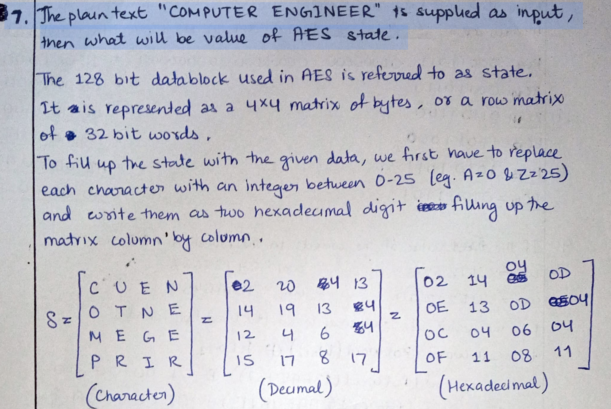
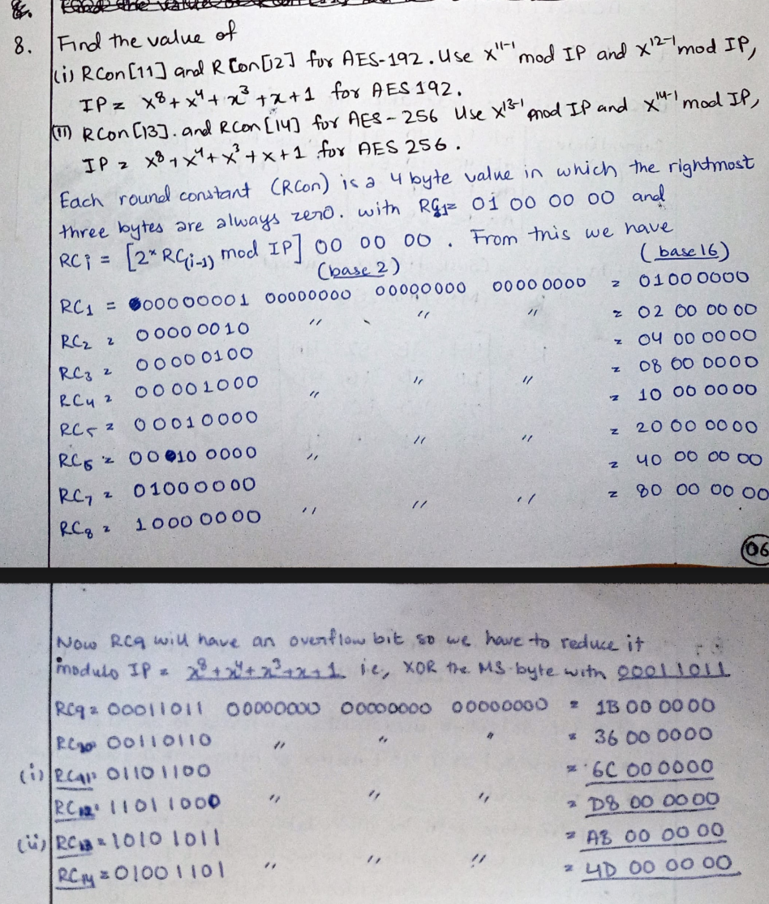

# 
W00​=2475A2B3
W01​=34755688
W02​=31E21200
W03​=13AA5487

- 🧠 AES Key Expansion Formula
- For i≡0 (mod 4):
> t=SubWord(RotWord(W03​))⊕Rcon[1]

1. 🔁 Step 1: RotWord
Rotate left (1 byte):
W03​=13 AA 54 87
=> RotWord=AA 54 87 13

2. 🔄 Step 2: SubWord (S-box substitution)
- From S-Box , (first row then col)
SubWord=AC 20 17 7D

3. Step 3: XOR with Rcon[1]
Rcon[1]=01 00 00 00
- t=AC 20 17 7D⊕01 00 00 00

- ✅ Final Answer
- AD 20 17 7D

# AES State :

# 
- Rcon upto 8 is shift by 1 or multiply by 2.
- Rcon after 8 oveflows , so we xor it with 00 01 10 11 (x^8 + x^4 + 3 + 1 + 0 )

# DES Initial Permutation (IP) and Inverse IP
1. 🧠 Step 1: Convert to Binary
- shift bits to their positions wrt IP table.

