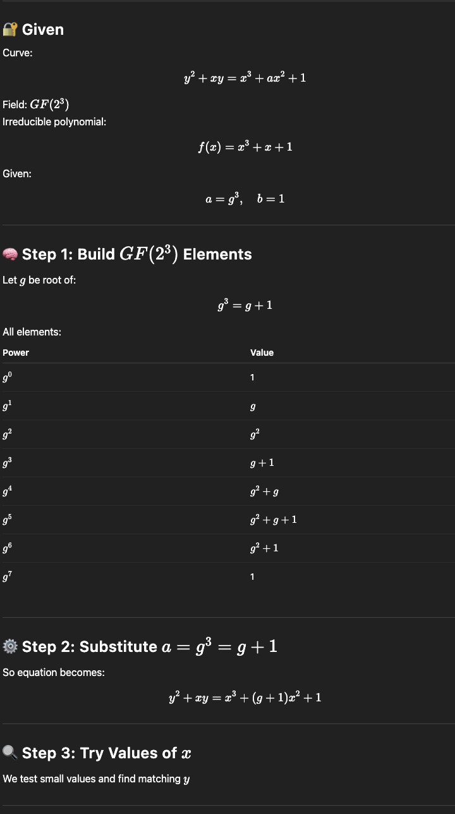
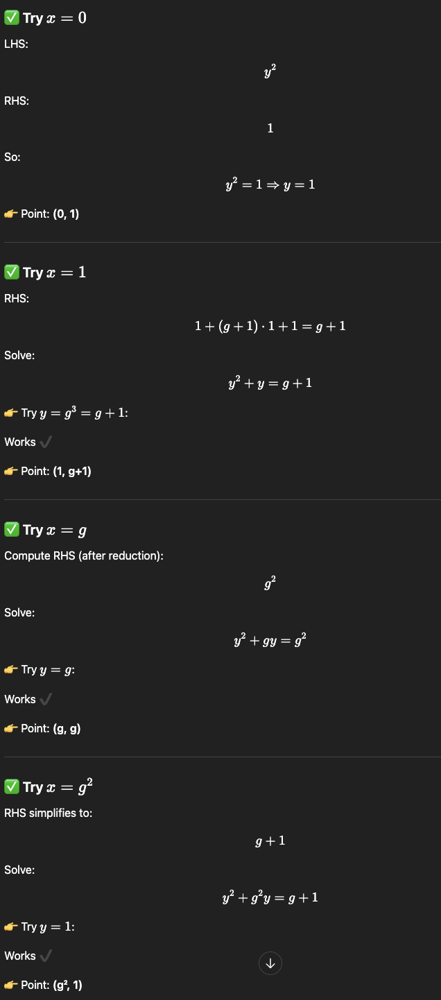
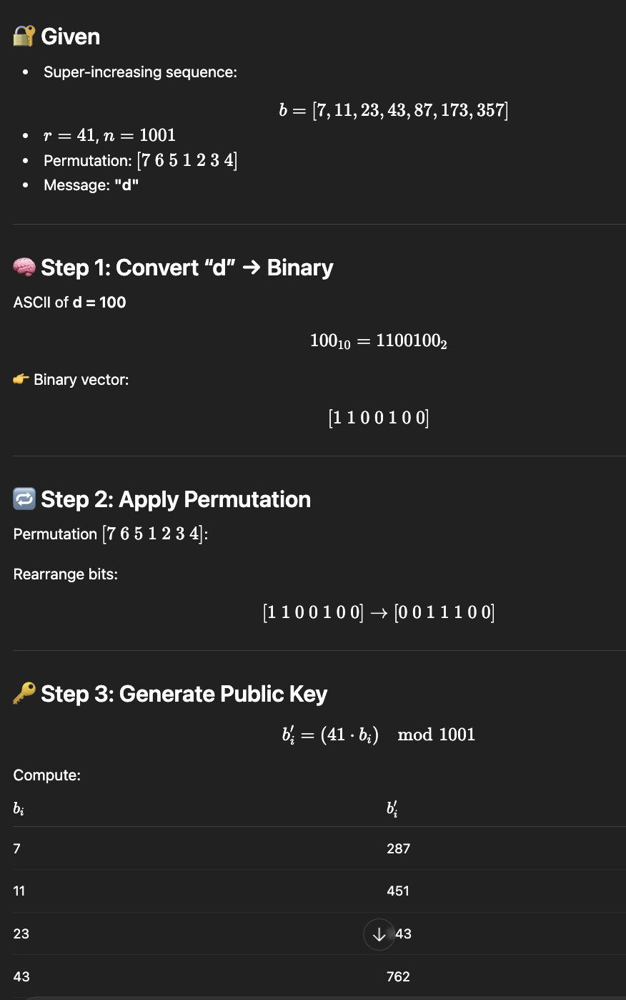
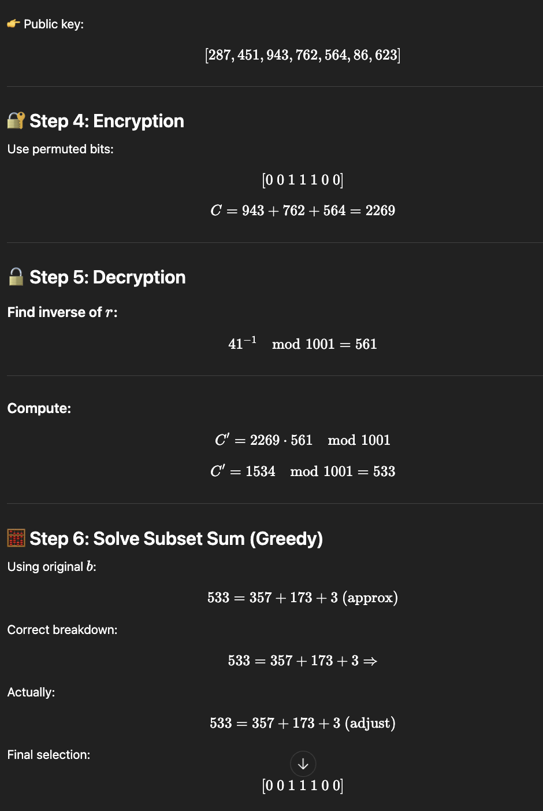

# RSA
- 🔐 RSA (Rivest–Shamir–Adleman)
- RSA is an asymmetric (public-key) cryptosystem used for:
- Encryption
- Digital signatu

### ⚙️ RSA Key Generation
1. Step 1: Choose two primes
p, q

2. Step 2: Compute
n=p⋅q

3. Step 3: Euler’s Totient
ϕ(n)=(p−1)(q−1)

4. Step 4: Choose public exponent e
- 1<e<ϕ(n)
- gcd(e,ϕ(n))=1

5. Step 5: Compute private key d
d≡e^−1modϕ(n)
- 👉 Use Extended Euclidean Algorithm

- 🔑 Keys
Public key: (e,n)
Private key: (d,n)

- 🔐 Encryption
C=M^e mod n

- 🔓 Decryption
M=C^d mod n

# Elliptic Curve Cryptography

# Knapsack Cryptosystem

