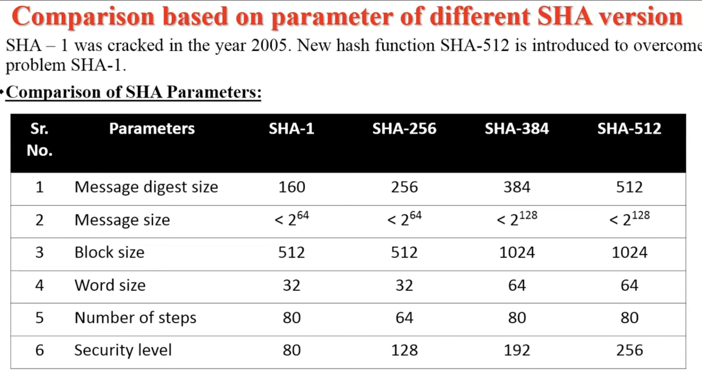

# MD5(Message Digest)
MD5 is a cryptographic hash function that produces:
👉 128-bit (16-byte) hash value
- 🧠 Basic Idea
Input: message of any size
Output: fixed 128-bit digest
Hash=H(M)

## ⚙️ MD5 Steps
1. Padding
Append 1 bit
Add 0s
Append 64-bit message length
👉 Final length ≡ 448 mod 512

2. Divide into Blocks
Each block = 512 bits

3. Initialize Buffers
- 4 registers (32-bit each):
A = 67452301  
B = EFCDAB89  
C = 98BADCFE  
D = 10325476

4. Processing (Main Rounds)
Total 64 operations
Divided into 4 rounds (16 each)

- 🔑 Functions Used
| Round | Function       |
| ----- | ---------------|
| 1     | F=(B∧C)∨(¬B∧D) |
| 2     | G=(B∧D)∨(C∧¬D) |
| 3     | H=B⊕C⊕D        |
| 4     | I=C⊕(B∨¬D)     |

- 🔁 Each Operation
A=B+((A+F+Mk​+Ti​)<<<s)
👉 Rotate left + add

5. Output
Final hash:
A∥B∥C∥D
👉 Total = 128 bits

# SHA-1
- SHA-1 is a cryptographic hash function that produces a:
👉 160-bit (20-byte) hash value

- 🧠 Basic Idea
Input: message of any size
Output: fixed 160-bit digest
Hash=H(M)

## ⚙️ SHA-1 Steps

1. 🔹 1. Padding
Append 1 bit
Add 0s
Append 64-bit length
- 👉 Final size ≡ 448 mod 512

2. Divide into Blocks
Each block = 512 bits

3. Initialize Buffers
5 variables (32-bit each):
A,B,C,D,E
- Initial values:
A = 67452301
B = EFCDAB89
C = 98BADCFE
D = 10325476
E = C3D2E1F0

4. Message Schedule
Divide block into 16 words W0–W15
- Extend to W0–W79
- Wt​=(Wt−3​⊕Wt−8​⊕Wt−14​⊕Wt−16​) <<<1

5. 80 Rounds Processing
Each round:
TEMP=(A<<<5)+f(B,C,D)+E+Wt​+Kt​
E=D,D=C,C=B<<<30,B=A,A=TEMP

- 🔑 Functions f
| Rounds | Function                                        |
| ------ | ----------------------------------------------- |
| 0–19   |  (B∧C)∨(¬B∧D)                                   |
| 20–39  | B⊕C⊕D                                           |
| 40–59  | (B∧C)∨(B∧D)∨(C∧D)                               |
| 60–79  | B⊕C⊕D                                           |

- 🔑 Constants K
| Rounds | Constant |
| ------ | -------- |
| 0–19   | 5A827999 |
| 20–39  | 6ED9EBA1 |
| 40–59  | 8F1BBCDC |
| 60–79  | CA62C1D6 |

6. Final Hash
Add results to initial values:
H0​=H0​+A, H1​=H1​+B,…

- Output
Final Hash=160-bit

## SHA versions

