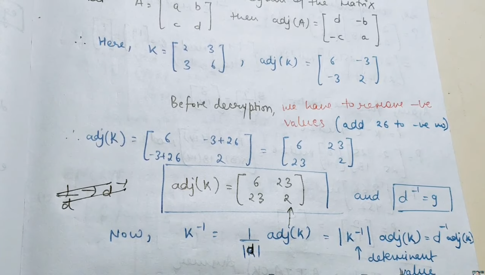
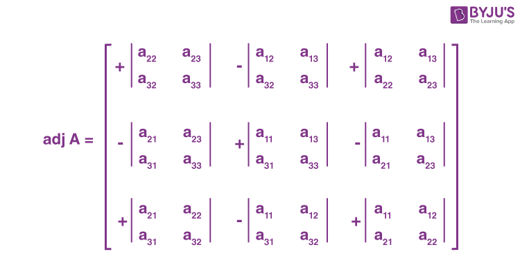

# Week 2: Data Encryption Standard (DES), Triple DES, Modes of Operation, Stream Cipher. 

## 1. Data Encryption Standard (DES)
- DES (Data Encryption Standard) is a symmetric key block cipher used for encrypting data.
    - Block size: 64 bits
    - Key size: 56 bits (effective)
    - Developed by IBM
    - Adopted by National Institute of Standards and Technology

- 🔹 Structure of DES
    - DES is based on a Feistel Network with 16 rounds.
- 🔸 Basic Steps:
1. Initial Permutation (IP)
2. Split into Left (L) & Right (R) halves
3. 16 rounds of:
    - Expansion
    - XOR with key
    - Substitution (S-box)
    - Permutation
4. Final Permutation (IP⁻¹)

- DES Round Function
- Each round:
    - Li​=Ri−1​
    - Ri​=Li−1​⊕f(Ri−1​,Ki​)

- 🔹 Advantages
✔️ Simple structure
✔️ Fast in hardware

- 🔹 Disadvantages
❌ Small key size (56-bit → easily breakable)
❌ Vulnerable to brute-force attacks

- 👉 Hence, DES is obsolete today

2. Triple DES (3DES)
- To improve DES security, Triple DES applies DES three times.
- 🔹 Working (EDE Mode)
    - Cipher=EK3​(DK2​(EK1​(Plaintext)))
- Encrypt → Decrypt → Encrypt
- 🔹 Key Options
- 3 keys (168-bit) → Most secure
- 2 keys (112-bit) → Moderate security

- 🔹 Advantages
✔️ Much more secure than DES
✔️ Resistant to brute-force attacks

- 🔹 Disadvantages
❌ Slow (3 times DES)
❌ Being replaced by modern algorithms like AES

3. Modes of Operation
- Block ciphers encrypt fixed-size blocks → modes define how blocks are processed.

    1. ECB (Electronic Codebook)
    - Each block encrypted independently
    - ✔️ Simple
    - ❌ Not secure (pattern visible)

    2. CBC (Cipher Block Chaining)
    - Each block depends on previous block
    - ✔️ More secure than ECB
    - ❌ Error propagation

    3. CFB (Cipher Feedback)
    - Converts block cipher → stream-like cipher
    - Uses previous ciphertext
    - ✔️ Suitable for real-time data

    4. OFB (Output Feedback)
    - Generates keystream independent of plaintext
    - ✔️ No error propagation
    - ❌ Synchronization required

    5. CTR (Counter Mode)
    - Uses counter values for encryption
    - ✔️ Fast & parallel processing
    - ✔️ Highly secure

4. Stream Cipher
- A stream cipher encrypts data bit-by-bit or byte-by-byte.
- Working Principle
> Ciphertext=Plaintext⊕Keystream

- 🔹 Types of Stream Ciphers
1. Synchronous Stream Cipher
Keystream depends only on key
2. Self-Synchronizing Stream Cipher
Keystream depends on previous ciphertext

- 🔹 Examples
- RC4 (older)
- Modern stream ciphers (ChaCha20)

- 🔹 Advantages
✔️ Fast
✔️ Low memory usage
✔️ Suitable for real-time communication

- 🔹 Disadvantages
❌ Key reuse is dangerous
❌ Less secure if poorly implemented

| Feature         | Block Cipher | Stream Cipher |
| --------------- | ------------ | ------------- |
| Data Processing | Block-wise   | Bit/byte-wise |
| Speed           | Slower       | Faster        |
| Memory          | More         | Less          |
| Example         | DES, AES     | RC4, ChaCha20 |

### 🔐 Shannon’s Theory of Confusion and Diffusion
- The ideas of confusion and diffusion were introduced by Claude Shannon to design strong encryption systems that resist attacks.

1. Confusion (cryptography) means:
    - between `key` and `ciphertext`
    - Making the relationship between the `key` and `ciphertext` as complex as possible
- ⚙️ How it is achieved
    - Using substitution techniques
    - Non-linear transformations (like S-boxes)
- 💡 Idea
    - 👉 If attacker sees ciphertext, they cannot figure out the key easily
- 📍 Example
    - Replacing letters using complex substitution rules
    - Used heavily in AES (S-box step)

2. Diffusion
- between `plaintext` and `ciphertext`
- Spreading the influence of one `plaintext` bit over many `ciphertext` bits
- ⚙️ How it is achieved
    - Using permutations and transpositions
    - Mixing bits across positions
- 💡 Idea
    - 👉 A small change in plaintext → large change in ciphertext
    - (This is called the avalanche effect)
- 📍 Example
    - Changing 1 bit affects many bits in output
    - Seen in modern block ciphers like DES and AES
> If a single letter in plaintext chnages then atleast half the cipher text should change and vice versa.
> Means each symbol in cipher is dependent on almost all plaintext sybmols.

## Hill Cipher Encryption and Decryption
- The Hill Cipher is a classical cipher that uses matrix multiplication to encrypt blocks of letters.
- 🧠 Basic Idea
    - Works on blocks of letters (not single letters like Caesar/Vigenère)
    - Uses linear algebra (matrices)
    - Each letter → number:
- 🔑 Encryption Formula
> C=K⋅Pmod26
- C = Ciphertext vector
- K = Key matrix
- P = Plaintext vector

- 🔓 Decryption Formula
> P=K^−1⋅Cmod26
- K^−1 = inverse of key matrix modulo 26
- For n*n key , n*1 matrices of plaintext are made.

### EXAMPLE .
- Plaintext: HI
- KEY : K=[ 3 ​3 ​]
          [ 2 ​5 ​]

1. 🔹 Step 1: Convert to numbers
- H = 7, I = 8
P = [7]
    [8​]

2. Step 2: Multiply

- C=K⋅P=[ 3 ​3 ​][7]
        [ 2 ​5 ​][8​].

3. 🔹 Step 3: Mod 26

4. Step 4: Convert back
19 = T, 2 = C
- 👉 Ciphertext = TC

### 🔄 Decryption Steps
- Find inverse of K modulo 26
- Multiply with ciphertext vector
- Take mod 26
- Convert back to letters

- ⚠️ Important Condition
- 👉 Key matrix must be invertible mod 26
- gcd(det(K),26)=1
- Otherwise, decryption is not possible.

#### Inverse 
- A^-1 = 1/|A| * Adj(A).
- 1/|A| = |A|^-1 = |A| * |A|^-1 = 1 mod 26.
- For 2*2 matrix 
    - Adj(A) = [ d -b ]
               [ -c a ]
    - for -ves +26.

- Adjoint of 3*3 Matrix 

