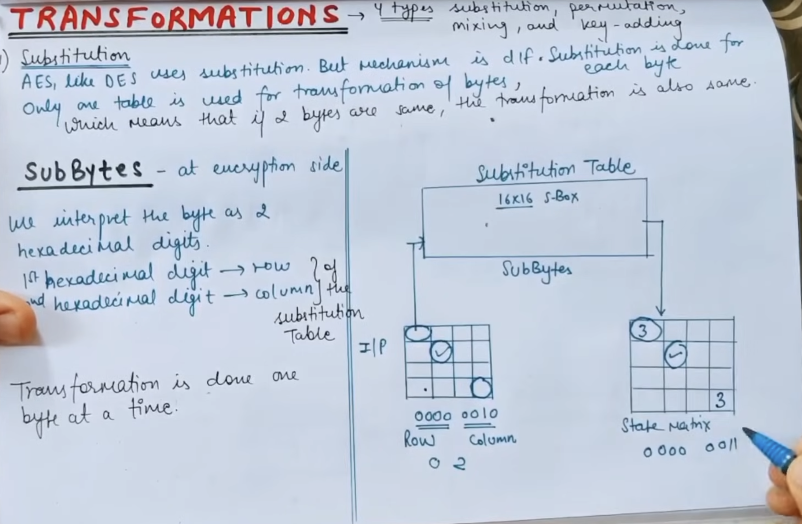
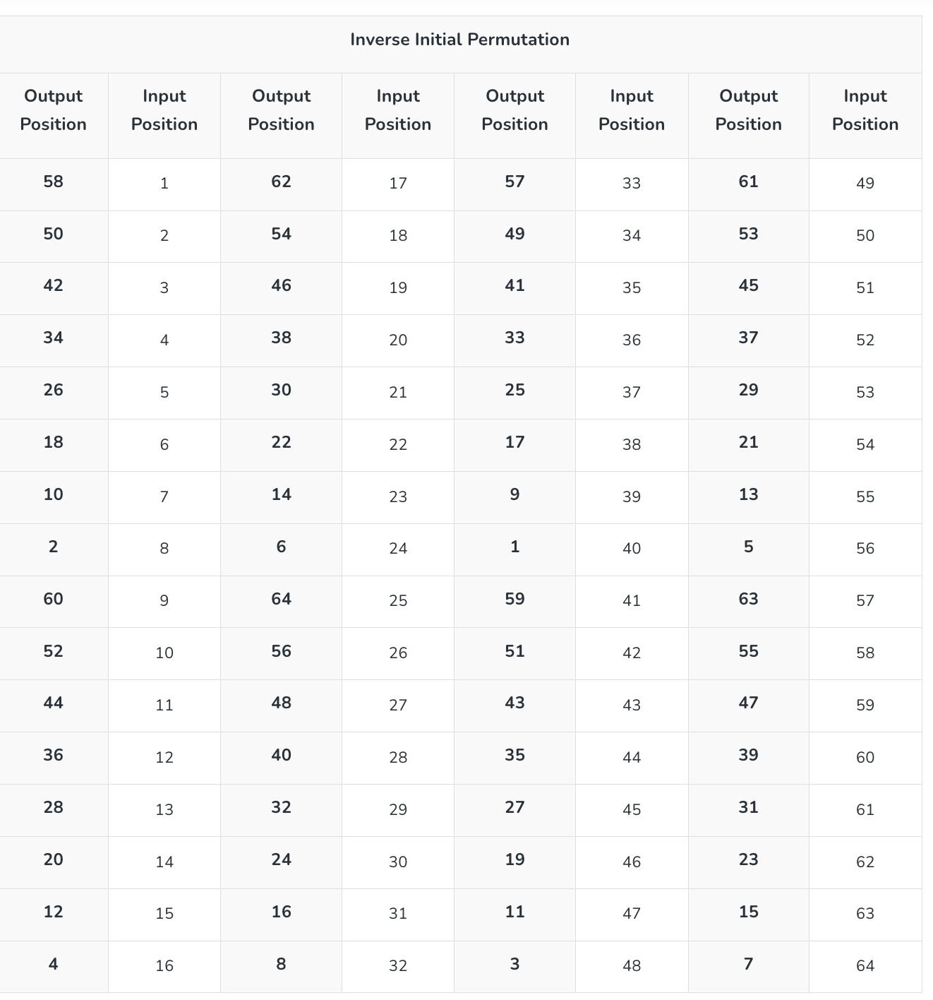

# 🔐 AES (Advanced Encryption Standard)
- AES is a symmetric key block cipher used worldwide for secure data encryption.
- Standardized by: NIST (2001)
- Based on: Rijndael algorithm
Block size: 128 bits
- Key sizes:
128-bit → 10 rounds
192-bit → 12 rounds
256-bit → 14 rounds

## ⚙️ AES Structure
- AES works on a 4×4 matrix (State) of bytes:
👉 Substitution + Permutation + Mixing + Key addition

## ⚙️ AES Encryption Steps
0. Initial Round
AddRoundKey
- XOR plaintext with initial key

1. Main Rounds (9 / 11 / 13 times)
- Each round has 4 steps:
    1. 1️⃣ SubBytes
    Replace each byte using S-box
    Non-linear substitution
    👉 Based on inverse in GF(2⁸)

    2. 2️⃣ ShiftRows
    - Row-wise cyclic shifts:
    | Row | Shift  |
    | --- | ------ |
    | 0   | 0      |
    | 1   | 1 left |
    | 2   | 2 left |
    | 3   | 3 left |

    3. 3️⃣ MixColumns
    Each column is transformed using matrix multiplication in GF(2⁸)
    02 03 01 01
    01 02 03 01 
    01 01 02 03 
    03 01 01 02 
        ​
    4. 4️⃣ AddRoundKey
    XOR state with round key

3. 🔹 Final Round
Same as above but without MixColumns
- Only 3 rounds

### 🔓 AES Decryption
- Uses inverse operations:
InvSubBytes
InvShiftRows
InvMixColumns
AddRoundKey

### 🔑 Key Expansion (Important)
- AES generates round keys using:
RotWord (rotate bytes)
SubWord (S-box)
Rcon (round constants)
XOR operations

# DES :
- 🔐 DES (Data Encryption Standard)
- DES is a symmetric block cipher used for encryption.
- Block size: 64 bits
Key size: 56 bits (64 bits including parity)
Structure: Feistel Network
Number of rounds: 16

- DES splits data into two halves and processes them through 16 rounds of substitution and permutation.

### ⚙️ DES Encryption Steps
1. Initial Permutation (IP)
Rearranges the 64-bit plaintext using a fixed table

- 1 to 64.
- 2 left top 
- +2 
- upper and lower seprate 

2. 🔹 2. Split
After IP: L0 (32 bits),R0 (32 bits)

3. 🔁 3. 16 Rounds
- Each round:
- Li​=R(i−1​)
- Ri​=Li−1​⊕F(Ri−1​,Ki​)

- Inside Function F
    1.  Expansion (E-box)
    Expand 32 bits → 48 bits

    2. 2️⃣ XOR with Key
    48-bit result⊕Ki
        ​
    3. 3️⃣ S-box Substitution
    8 S-boxes
    Each:
    Input: 6 bits
    Output: 4 bits
    👉 Total: 48 → 32 bits

    4. 4️⃣ Permutation (P-box)
    Rearranges bits

4. 🔹 4. Swap
- After 16 rounds:
Swap L16 and R16
	​
5. 🔹 5. Final Permutation (IP⁻¹)
Inverse of initial permutation

### 🔑 Key Generation (Key Schedule)
- 64-bit key → remove parity → 56 bits
    Split into two halves
    Left shifts
    Compression → 48-bit round keys
- 👉 Generate 16 keys K1 to K16
	​

### 🔓 Decryption
- Same as encryption but:
Use keys in reverse order:

# SHA-512

	​

	​

