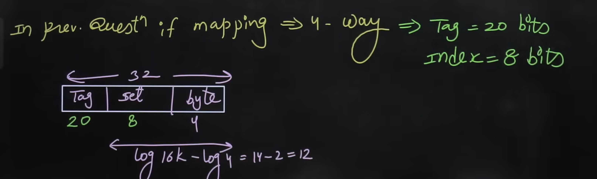
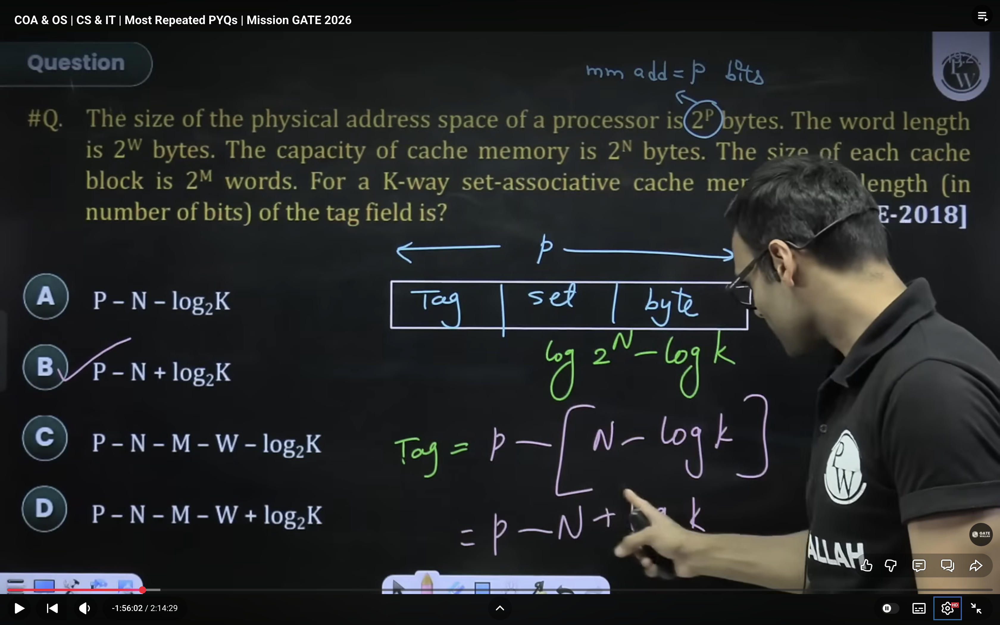
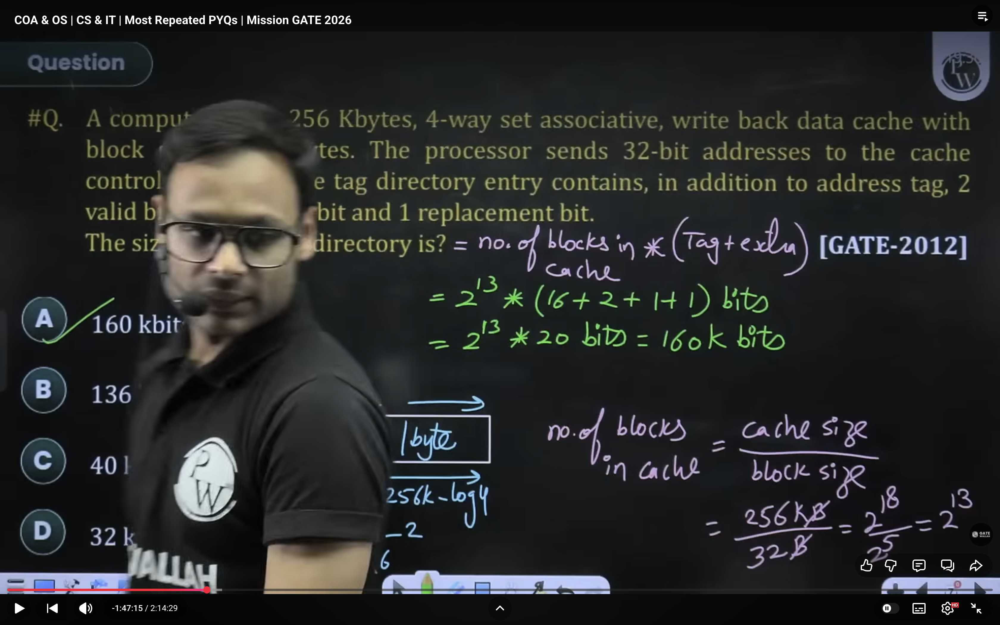
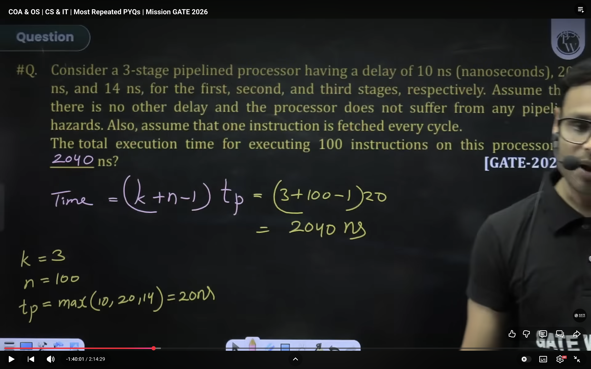
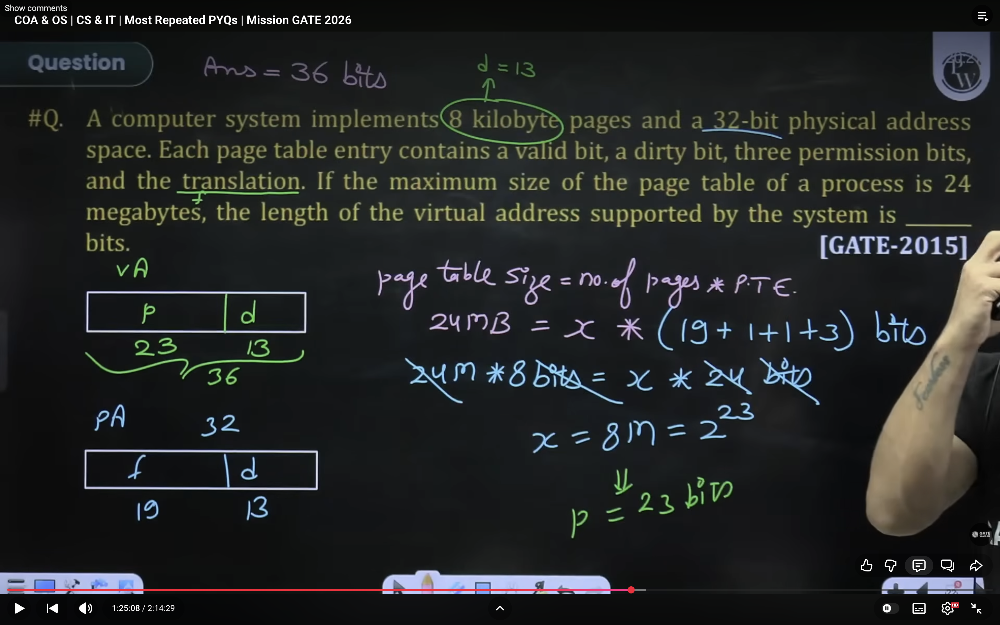
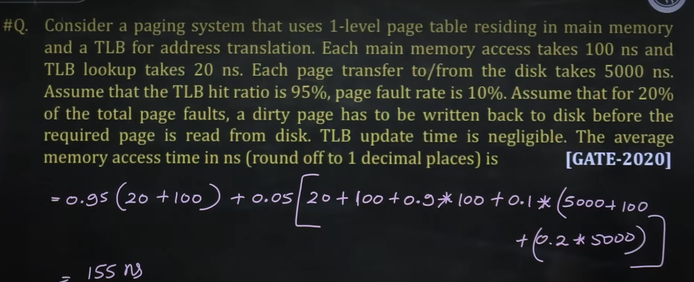

## ✅ Given
- Cache size = 16 KB
- Block size = 16 Bytes
- Fully associative cache
- Main memory = Byte addressable
- Address size = 32 bits

1. ✅ Step 1: Find Block Offset Bits
- Block size = 16 bytes
- Since memory is byte addressable:
- Offset bits  
> log(16)=4

2. ✅ Step 2: Find Number of Cache Blocks
> Number of blocks = 16KB/16B =  2^10.

3. ✅ Step 3: Index Bits (Fully Associative)
- 👉 Fully associative cache means:
    - Any block can go anywhere
    - No index field is required
>  Index bits=0

4. ✅ Step 4: Tag Bits
- Total address bits = 32
- Address structure:
Tag | Index | Offset
28  | 0     | 4

## 

## 

## PIPELINE :
> Time = (k+n-1)*tp.
- 

## 

## 

##

